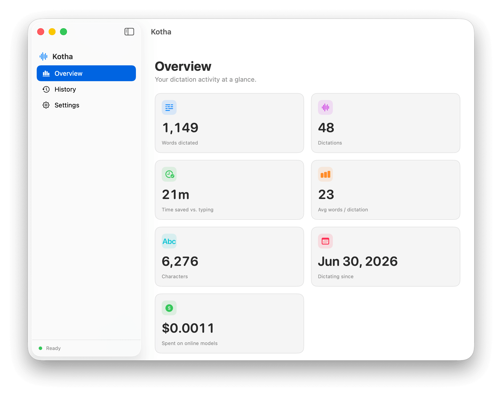

# Kotha (কথা)

A minimal, personal macOS voice-typing app — a trimmed-down Spokenly. Hold a
modifier key, speak, release, and the transcribed text is pasted into whatever
app is focused.

- **Hold Right ⌘** → English
- **Hold Right ⌥** → Bangla

It lives in the menu bar (no Dock icon) and shows a small HUD while recording,
transcribing, and refining.



## Transcription models

Each language is assigned a model in *Settings*. Available engines:

| Model | Type | Notes |
|-------|------|-------|
| Apple on-device | local, built-in | No download, private. English + Bangla (where the OS supports it). |
| NVIDIA Parakeet TDT 0.6B (v3 / v2) | local, download | Ultra-fast, offline. English only. |
| Whisper Large v3 Turbo | local, download | Multilingual, higher accuracy. |
| Soniox | online | Fast & accurate Bangla. Needs an API key. |
| OpenAI `gpt-4o-transcribe` | online | Multilingual. Needs an API key. |

Downloadable models are managed in *Settings → Local Models* (download / delete
with progress), stored under `~/Library/Application Support/Kotha/Models`.

## Extras

- **Vocabulary cleanup** — an on-device AI pass fixes mis-transcribed brand/product
  names (e.g. *FlyCommerce*, *Dokan*, *weDevs*) without changing meaning. Uses Apple
  FoundationModels, or a small MLX model (Qwen 0.5B / Llama 3.2 1B / Gemma 2 2B).
- **Activation modes** — Hold, Toggle, Double-tap, or Hold-or-tap.
- **History** — every dictation is kept (viewable/clearable), with the before/after
  text when cleanup changed something.
- **HUD** — premium recording / transcribing / refining / success / error states,
  with a hover cancel button and a timeout for stuck transcriptions.
- Copy-to-clipboard option, input-device selector, launch at login.

## Build & run

Requires [XcodeGen](https://github.com/yonsson/XcodeGen) (`brew install xcodegen`).

```bash
./run.sh          # quick Debug build + launch from ./build
./build.sh        # Release build, re-sign, install to /Applications, launch
```

`run.sh` / `build.sh` regenerate the Xcode project from `project.yml`. You can
also `xcodegen generate` and open `Kotha.xcodeproj` in Xcode.

> **Regenerate after adding/removing source files:** `xcodegen generate` (the
> scripts already do this). The `.xcodeproj` is generated and not tracked in git.

## Stable code signing (recommended)

By default the app is ad-hoc signed, which means macOS re-prompts for
**Accessibility** after every rebuild. To make permissions persist, create a
self-signed code-signing identity once:

```bash
./setup-signing.sh
```

`build.sh` then re-signs the installed app with that identity, so Accessibility
(and the paste hotkeys) survive rebuilds.

## First-time setup

1. **Microphone** — macOS prompts on first dictation. Allow it.
2. **Accessibility** — needed for the global hotkeys and to paste. Grant it in
   *Settings → Permissions & Audio → Accessibility*, or in
   *System Settings → Privacy & Security → Accessibility*.
3. **API keys (Soniox / OpenAI)** — menu-bar icon → *Settings… → Online Models*,
   paste the key, click Save.

API keys are stored in `~/Library/Application Support/Kotha/keys.json` (owner-only,
`chmod 600`) rather than the Keychain — the Keychain re-prompts on every rebuild
because the code signature changes.

## How it works

Sources are grouped by responsibility:

| Area | Folder | What's there |
|------|--------|--------------|
| App entry | `Sources/App/` | `KothaApp` (scenes, `AppDelegate`), `Info.plist`, entitlements, `Assets.xcassets` |
| Capture & orchestration | `Sources/Core/` | `AppState` (activation modes, pipeline), `AudioRecorder` (→ 16 kHz mono), `WAV` |
| Transcription | `Sources/Transcription/` | model catalog + `ModelManager`/`DownloadManager`, Parakeet/Whisper/`AppleSpeechEngine`, Soniox & OpenAI |
| Vocabulary cleanup | `Sources/Cleanup/` | `CleanupManager`, `MLXCleanupEngine`, `AICleanup`, known-term `VocabularyStore` |
| Persistence | `Sources/Data/` | `JSONStore` + `AppPaths`, `SecretStore`, `HistoryStore` (stats), `Pricing` |
| OS integration | `Sources/System/` | `HotkeyMonitor` (CGEventTap), `TextInserter` (paste), permissions, Dock policy, login item |
| UI | `Sources/UI/` | `MainView` (sidebar), `OverviewView`, `HistoryView`, `SettingsView`, `MenuView`, `ListeningPanel` (HUD) |

## Notes

- Audio is transcribed in memory and never written to disk.
- Hotkeys are the right-side modifier key codes (54 = right ⌘, 61 = right ⌥) in
  `HotkeyMonitor.swift`.
- The Bangla/online path is **batch**: it uploads the clip on release and waits
  for the result, so longer clips take a moment.
